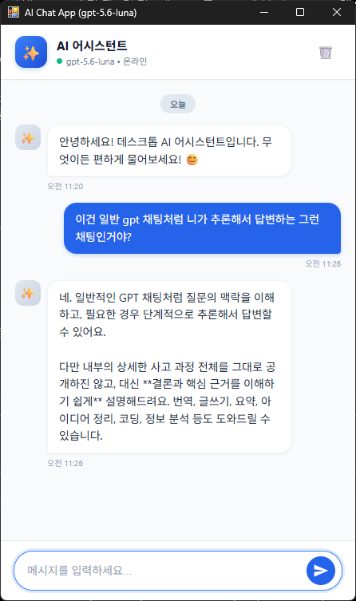

# Desktop AI Chat App

`pywebview`와 OpenAI의 최신 `Responses API` (`gpt-5.6-luna`)를 기반으로 제작된 경량 데스크톱 AI 메신저 프로그램입니다.

---

## 📸 실행 화면

<p align="center">
  
</p>

---

## 📱 주요 기능
- **데스크톱 네이티브 창 실행**: 브라우저 없이 독립된 Windows 네이티브 애플리케이션으로 실행
- **실제 AI 통신**: OpenAI 최신 Responses API (`gpt-5.6-luna`) 기반 답변 생성
- **멀티턴 대화 유지**: 질문-답변 히스토리를 기억하여 자연스러운 연속 대화 지원
- **실시간 로딩 인디케이터**: AI 답변 생성 중 점 바운스 애니메이션 노출
- **대화 초기화 기능**: 상단 휴지통 아이콘을 통한 백엔드 컨텍스트 및 화면 메시지 동시 초기화
- **안전한 보안 관리**: `.env` 파일을 통한 API 키 관리 및 Git 추적 원천 차단

---

## 📁 프로젝트 구조
- `src/desktop_app/`:
  - `__init__.py`: 데스크톱 앱 실행 메인 진입점 (`webview.create_window`)
  - `api.py`: JavaScript와 통신하는 `ChatApi` 브리지 및 OpenAI Responses API 호출 로직
- `index.html`: 메신저 UI 마크업
- `style.css`: 모던 데스크톱 메신저 레이아웃 및 반응형 스타일링
- `script.js`: pywebview 비동기 API 통신 및 UI 상태 관리
- `docs/screenshot.png`: 실제 데스크톱 프로그램 구동 스크린샷
- `openai_test.py` / `openai_test.ipynb`: OpenAI Responses API 단독 테스트 코드

---

## 🚀 데스크톱 앱 실행 방법

터미널에서 아래 명령어를 실행하면 데스크톱 메신저 창이 열립니다:

```bash
uv run desktop-app
```
*(또는 `uv run python -m desktop_app`)*
