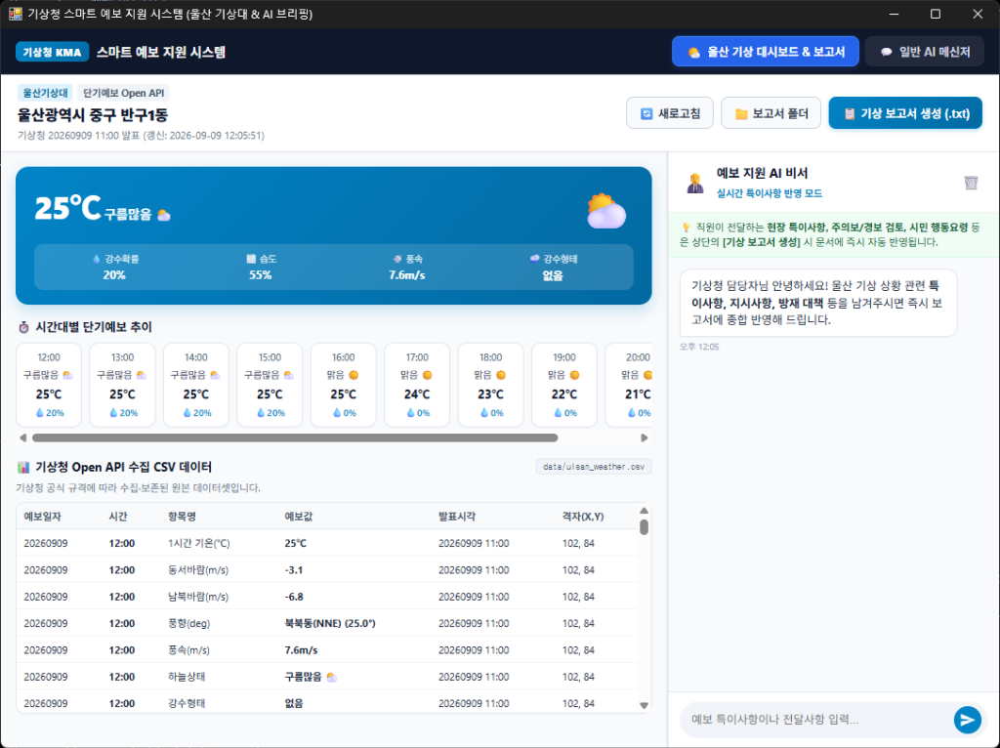

# 기상청 스마트 예보 지원 시스템 & 울산 기상 대시보드

`pywebview`와 OpenAI의 최신 `Responses API` (`gpt-5.6-luna`), 그리고 **기상청 단기예보 Open API**를 결합하여 제작된 기상 실무자용 스마트 예보 지원 및 브리핑 보고서 자동 생성 데스크톱 프로그램입니다.

---

## 📸 프로그램 실행 화면

### 🌟 [현재 버전] 기상청 스마트 예보 지원 시스템 & 예보관 AI 어시스턴트
<p align="center">
  
</p>

---

## 🚀 프로젝트 발전 과정 (Project Evolution)

단순한 웹 메신저 프로토타입에서 기상청 실무를 지원하는 고도화된 전문 데스크톱 애플리케이션으로 확장되었습니다.

| 단계 | 주요 기능 및 화면 | 미리보기 |
| :--- | :--- | :---: |
| **Step 1: 심플 AI 메신저** | • 순수 HTML/CSS/JS 기반 경량 메신저 UI<br>• OpenAI Responses API (`gpt-5.6-luna`) 멀티턴 연동<br>• `pywebview` 기반 독립 실행형 윈도우 앱 전환 |  |
| **Step 2: 기상청 스마트 예보 지원 시스템 (현재)** | • **기상청 단기예보 Open API** 실시간 연동 (울산 중구 반구1동)<br>• 실시간 관측 요약 카드 및 시간대별 예보 추이 타임라인<br>• 수집된 **기상청 원본 CSV 데이터 테이블 뷰어** (`data/ulsan_weather.csv`)<br>• **예보 지원 AI 비서 챗봇**: 현장 특이사항/지시사항 실시간 접수<br>• **원클릭 기상 통보서/보고서 생성 (`.txt`)**: 날씨 데이터 + 예보관 대화 종합 자동 작성 (`reports/` 폴더 저장)<br>• **원클릭 실행 런처 (`run.bat`, `run_silent.vbs`)** 제공 |  |

---

## 📱 주요 기능 상세

### 1. 🌤️ 울산 기상 대시보드 & 예보관 실시간 챗봇
- **기상청 단기예보 Open API 실시간 연동**: 울산광역시 중구 반구1동(격자 X: 102, Y: 84) 기준 최신 발표 예보 데이터 자동 수집
- **실시간 기상 현황 카드 & 타임라인**: 기온, 강수확률(POP), 습도(REH), 풍속(WSD), 시간대별 예보 변화 시각화
- **기상청 수집 CSV 원본 테이블**: API 응답을 `data/ulsan_weather.csv`에 원본 컬럼 구조 그대로 보존 및 직접 조회
- **우측 예보 지원 AI 챗봇 사이드바**:
  - 기상청 직원이 현장 관측 정보, 특보 발령 검토 의견, 시민 방재 지시사항 등을 실시간으로 전달
  - 챗봇이 이를 기억하고 대화 내역을 보관
- **📋 원클릭 공식 기상 통보서/보고서 생성 (`.txt`)**:
  - **[기상 보고서 생성]** 버튼 클릭 시, 수집된 기상 데이터와 **예보관이 챗봇에게 전달한 추가/특이사항을 종합**하여 공식 기상 통보문 포맷의 텍스트 문서를 즉시 작성
  - 작성된 보고서는 `reports/기상보고서_울산_YYYYMMDD_HHMMSS.txt`로 자동 저장
  - UI 상에서 즉시 미리보기 팝업 제공 및 `📁 폴더 열기`, `📋 내용 복사` 지원
  - (※ 챗봇에게 별도 지시를 하지 않은 경우에도 기상청 표준 정제 데이터를 바탕으로 기본 보고서 자동 생성)

### 2. 💬 일반 AI 메신저 탭
- **독립된 데스크톱 AI 메신저**: `gpt-5.6-luna` 모델 기반 일반 목적 멀티턴 질의응답 및 비서 기능

---

## 📁 프로젝트 구조
- `src/desktop_app/`:
  - `__init__.py`: 데스크톱 앱 실행 메인 진입점 (1100x820 와이드 윈도우 생성)
  - `api.py`: JavaScript ↔ Python 통합 브리지 (메신저, 날씨, 챗봇, 보고서 생성 및 폴더 열기)
  - `weather.py`: 기상청 단기예보 Open API 수집 및 `data/ulsan_weather.csv` 관리
  - `report.py`: 기상청 데이터와 예보관 대화를 종합하여 전문 `.txt` 보고서를 생성하는 `WeatherReportGenerator`
- `data/`:
  - `ulsan_weather.csv`: 기상청 단기예보 실시간 수집 원본 CSV 데이터셋
- `reports/`:
  - `기상보고서_울산_*.txt`: AI가 자동 생성한 공식 기상 보고서 텍스트 파일 저장소
- `index.html`: 2열 워크스페이스 (대시보드 + 챗봇) 및 보고서 모달 UI
- `style.css`: 기상청 전문 포털 스타일의 모던 UI 디자인
- `script.js`: 비동기 통신, 챗봇 인터랙션, 보고서 생성 및 클립보드 복사
- `run.bat` / `run_silent.vbs`: 더블 클릭 원클릭 실행 스크립트
- `docs/`: 실제 프로그램 구동 스크린샷 (Step 1, Step 2)

---

## 🚀 실행 방법

### 방법 1. 바로 실행 (더블 클릭)
- **`run.bat`**: 파일을 더블 클릭하면 콘솔 안내 메시지와 함께 즉시 프로그램이 시작됩니다.
- **`run_silent.vbs`**: 검은 콘솔창 없이 백그라운드로 프로그램 창만 바로 띄우고 싶을 때 더블 클릭합니다.

### 방법 2. 터미널 명령어 실행
```bash
uv run desktop-app
```
*(또는 `uv run python -m desktop_app`)*
